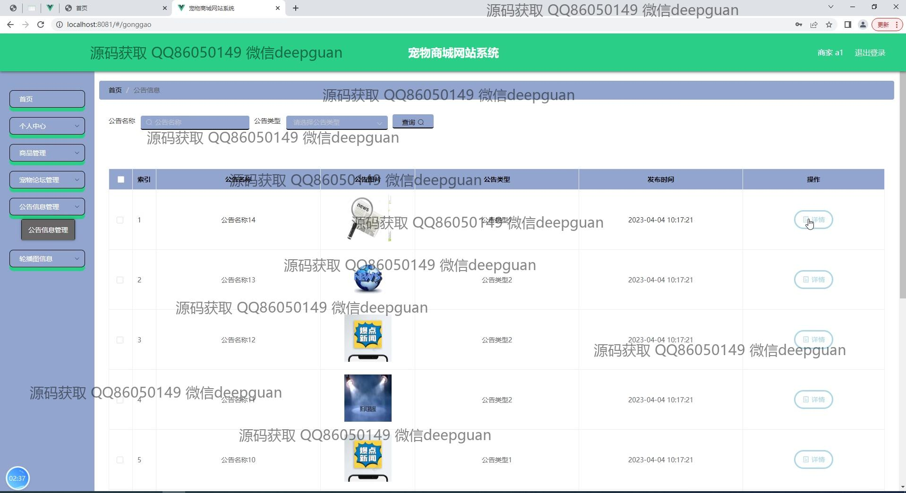

<h1 align="center">基于Springboot宠物商城网站系统</h1>

## 简介
宠物商城系统：角色分为管理员、用户；主要功能包括商品管理、订单管理、用户管理、公告信息管理、宠物论坛、个人中心和购物车，支持商品评论和商家管理，提供丰富的互动与管理功能。    --计算机毕业设计源码；毕设源码；java毕业设计源码

## 联系方式

<h3 align="center">获取完整代码与数据库文件 + 微信：deepguan QQ: 86050149 QQ群: 783742310</h3>

<h3 align="center">可帮忙远程部署 包运行成功！提供远程部署、修改代码、设计文档指导、代码讲解等服务！</h3>

## 功能介绍（完整见运行截图）
管理员：管理员可以访问和管理后台功能，包括商品管理、用户管理、商家管理、宠物论坛管理、公告信息管理、轮播图信息管理和订单管理。管理员能够查看和编辑商品信息，管理用户和商家的账户信息，处理用户订单并进行状态更新。此外，管理员还能够上传和更新网站的轮播图以及管理公告信息和商家资料。管理员界面支持商品评论管理，便于查看和回应用户的反馈。  
   
用户：用户可以注册、登录和访问个人中心。用户在个人中心可以查看和修改自己的个人信息，包括密码修改、地址管理、订单查询和商品收藏。用户可以参与宠物论坛，创建新帖子并与其他用户交流。用户还可以在商城浏览商品列表，查看商品详情，添加商品到购物车并完成购买。用户订单状态可以被查看，如“已收货”或“已退款”，同时支持对订单进行评价。  
   
商家：商家可以管理他们在商城上的商品，包括上传新商品、管理库存、编辑商品介绍和价格。商家能够输入和维护自身的商家信息，比如联系方式、商家名称及营业执照上传。商家还可以处理订单，查看和管理收到的客户评价，并回复客户反馈以增进客户关系。  

以上是Springboot宠物商城网站系统中各角色的功能介绍。

## 运行截图

本代码来源于网络,仅供学习参考使用!

